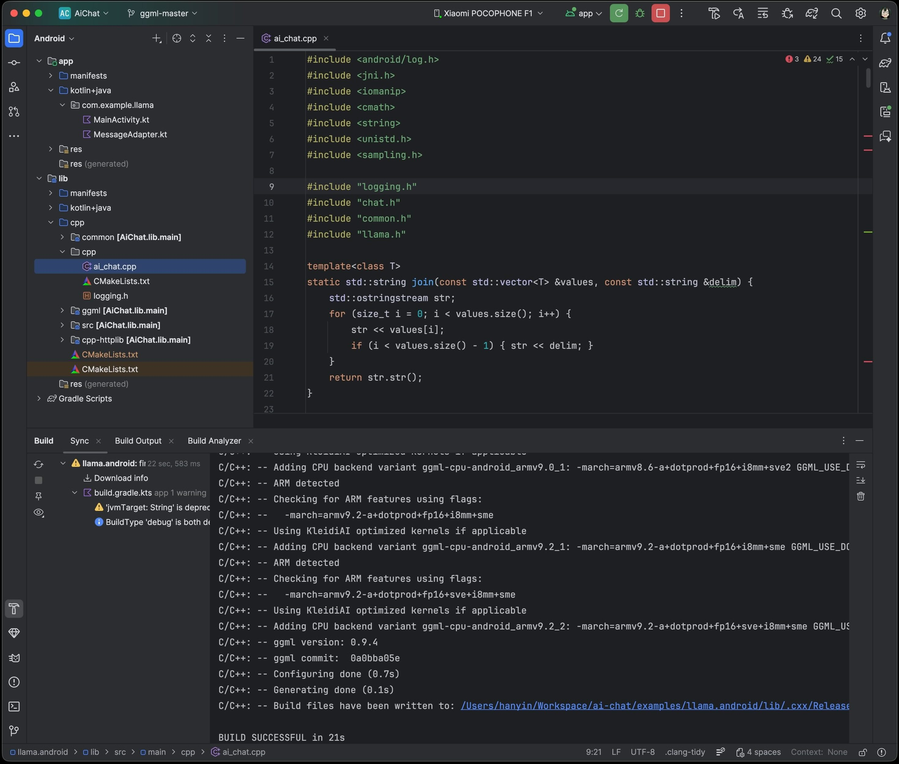

> 🌐 本文档由 [ggml-org/llama.cpp](https://github.com/ggml-org/llama.cpp) 翻译,英文原版见原项目。

# Android

## 使用 Android Studio 构建 GUI 绑定

把 `examples/llama.android` 目录导入 Android Studio,然后执行 Gradle sync 并构建项目。


此 Android 绑定支持硬件加速:在 Android 和 ChromeOS 设备上,**Arm** 平台最高支持到 `SME2`,`x86-64` 平台支持 `AMX`。
它会自动检测宿主硬件并加载兼容的内核。因此无论是最新的高端设备,还是缺少现代 CPU 特性或内存有限的老旧设备,它都能无缝运行,无需任何手动配置。

绑定内置了一个极简的 Android 应用前端,用于展示其核心功能:
1.	**解析 GGUF 元数据**:通过 `GgufMetadataReader`,既可以从共享存储中 `ContentResolver` 提供的 `Uri` 读取,也可以从应用私有存储中的本地 `File` 读取。
2.	**获取 `InferenceEngine` 实例**:通过 `AiChat` 门面类获取,并用应用私有文件路径加载你选定的模型。
3.	**发送原始用户提示词**:自动完成模板格式化、prefill 和批量解码,然后在 Kotlin `Flow` 中收集生成的 token。

如果你想要生产级体验,包括系统提示词、基准测试等高级功能,以及模型管理、Arm 特性可视化等友好 UI,请到 Google Play 体验 [Arm AI Chat](https://play.google.com/store/apps/details?id=com.arm.aichat)。
本项目由 Arm 的 **CT-ML**、**CE-ML** 和 **STE** 团队协作完成:

|   |   |   |
|:------------------------------------------------------:|:----------------------------------------------------:|:--------------------------------------------------------:|


|                      主界面                       |                    系统提示词                     |                         "Haiku"                          |

## 使用 Termux 在 Android 上构建 CLI

[Termux](https://termux.dev/en/) 是一款 Android 终端模拟器和 Linux 环境应用(无需 root)。截至撰写时,Termux 在 Google Play 商店中以实验性形式提供;此外也可以直接从项目仓库或 F-Droid 获取。

借助 Termux,你可以像在 Linux 环境中一样安装和运行 `llama.cpp`。进入 Termux shell 后:

```
$ apt update && apt upgrade -y
$ apt install git cmake libandroid-spawn
```

然后按照[构建说明](https://github.com/ggml-org/llama.cpp/blob/master/docs/build.md)操作,特别是 CMake 部分。

二进制文件构建完成后,下载你想要的模型(例如从 Hugging Face 下载)。建议放到 `~/` 目录以获得最佳性能:

```
$ curl -L {model-url} -o ~/{model}.gguf
```

然后,如果还不在仓库目录中,先 `cd` 进入 `llama.cpp`,再执行:

```
$ ./build/bin/llama-cli -m ~/{model}.gguf -c {context-size} -p "{your-prompt}"
```

这里演示的是 `llama-cli`,但理论上 `examples` 下的任何可执行文件都能用。务必把 `context-size` 设成合理的数值(比如 4096)起步;否则内存可能暴涨,直接把你的终端干掉。

想直观看看效果,这里有一段在 Pixel 5 手机上运行交互会话的旧演示视频:

https://user-images.githubusercontent.com/271616/225014776-1d567049-ad71-4ef2-b050-55b0b3b9274c.mp4

## 使用 Android NDK 交叉编译 CLI

可以在宿主系统上通过 CMake 和 Android NDK 为 Android 构建 `llama.cpp`。如果你有兴趣走这条路,请确保已经准备好 Android 交叉编译环境(即安装好 Android SDK/NDK,并把 `ANDROID_NDK` 指向 NDK 根目录)。注意,与桌面环境不同,Android 环境自带的本地库集合很有限,因此使用 Android NDK 构建时 CMake 只能用这些库(见:https://developer.android.com/ndk/guides/stable_apis 。)

准备就绪并克隆好 `llama.cpp` 后,在项目目录中执行:

```
$ cmake \
  -DCMAKE_TOOLCHAIN_FILE=$ANDROID_NDK/build/cmake/android.toolchain.cmake \
  -DANDROID_ABI=arm64-v8a \
  -DANDROID_PLATFORM=android-28 \
  -DGGML_NATIVE=OFF \
  -DGGML_OPENMP=OFF \
  -DGGML_LLAMAFILE=OFF \
  -DLLAMA_OPENSSL=OFF \
  -B build-android
```

说明:
  - 交叉编译必须设置 `GGML_NATIVE=OFF`,因为宿主 CPU 不是 Android 目标 CPU
  - 虽然较新版本的 Android NDK 自带 OpenMP,但 CMake 仍需把它作为依赖安装,目前不支持这种做法
  - `llamafile` 似乎不支持 Android 设备(见:https://github.com/Mozilla-Ocho/llamafile/issues/325 )
  - `LLAMA_OPENSSL=OFF` 可避免依赖 OpenSSL,它不属于 Android NDK 的稳定原生 API 集合

上面的命令配置的是可移植的 Android `arm64-v8a` 构建。除非你有意抬高所有编译源码的基线指令集,否则不要添加全局 `-march` 标志。

关于 Android `arm64-v8a` 上可选的 KleidiAI 加速,见 [build.md 的 Arm KleidiAI 一节](./build.md#arm-kleidiai)。

可以按你的目标随意调整 Android ABI。项目配置完成后:

```
$ cmake --build build-android --config Release -j{n}
$ cmake --install build-android --prefix {install-dir} --config Release
```

安装完成后,在你选择的宿主系统上下载想要的模型。然后:

```
$ adb shell "mkdir /data/local/tmp/llama.cpp"
$ adb push {install-dir} /data/local/tmp/llama.cpp/
$ adb push {model}.gguf /data/local/tmp/llama.cpp/
$ adb shell
```

在 `adb shell` 中:

```
$ cd /data/local/tmp/llama.cpp
$ LD_LIBRARY_PATH=lib ./bin/llama-simple -m {model}.gguf -c {context-size} -p "{your-prompt}"
```

搞定!

注意,Android 不会自己找到 `lib` 这个库路径,所以必须指定 `LD_LIBRARY_PATH` 才能运行安装好的可执行文件。较高 API 版本的 Android 支持 `RPATH`,未来这一点可能会改变。`context-size`(非常重要!)以及其他 `examples` 的运行方式请参考上一节。
